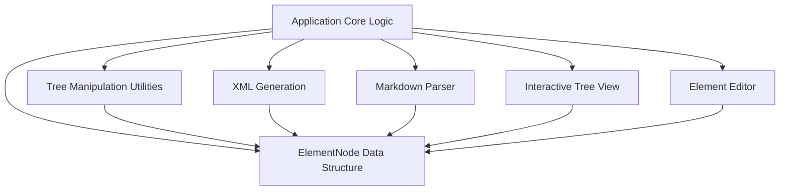

# XMLPromptBuilder

A user-friendly web application for building complex XML prompts for AI models. Create and manage hierarchical XML structures through an interactive tree view and detailed editor, with support for Markdown conversion and real-time XML generation.

## Features

- **Interactive Tree View**: Visual hierarchy management with drag-and-drop-like controls
- **Element Editor**: Edit tag names, content, and properties for each XML element
- **Markdown to XML Conversion**: Automatically convert Markdown text to structured XML elements
- **Real-time XML Generation**: See your XML output update instantly as you work
- **Code Block Support**: Mark elements as code with language specification
- **CDATA Handling**: Automatic or manual CDATA wrapping for special content
- **Persistent Storage**: Auto-saves work to browser local storage
- **Theme Support**: Light and dark mode
- **Syntax Highlighting**: Color-coded XML preview

## Architecture Overview



## Core Components

### 1. Interactive Tree View (`src/components/Tree.tsx`)

The left panel showing your XML structure as a collapsible tree.

**Features:**
- Click elements to select and edit
- Expand/collapse branches with arrow icons
- Add child elements with the plus button
- Delete elements with the trash button
- Reorder siblings with up/down arrows

### 2. Element Editor (`src/components/Editor.tsx`)

The right panel for editing selected element details.

**Controls:**
- **Tag Name**: The XML element name (e.g., `instruction`)
- **Content**: Text or code inside the element
- **Code Block**: Checkbox to mark content as code
- **Language**: Programming language selector (appears when Code Block is checked)
- **Force CDATA**: Manual CDATA wrapping option
- **Actions**: Add Child, Auto Child (for lists), MD→XML conversion

### 3. ElementNode Data Structure (`src/lib/types.ts`)

The internal representation of each XML element.

```typescript
interface ElementNode {
  id: string;           // Unique identifier
  tagName: string;      // XML tag name
  content: string;      // Text content
  children?: ElementNode[];  // Nested elements
  codeBlock?: boolean;  // Is this a code block?
  codeLanguage?: string; // Programming language
  attributes?: Record<string, string>; // XML attributes
  forceCDATA?: boolean; // Force CDATA wrapping
  collapsed?: boolean;  // UI collapse state
}
```

### 4. Markdown Parser (`src/lib/markdownParser.ts`)

Converts Markdown text to ElementNode structure.

**Supported Elements:**
- Headings (`# H1` → `<h1>`)
- Paragraphs → `<p>`
- Lists (ordered/unordered) → `<ol>`/`<ul>` with `<li>` children
- Code blocks → `<pre><code>` with language detection
- Tables → `<table>` structure
- Blockquotes → `<blockquote>`

**Usage:**
1. Select a parent element in the tree
2. Paste Markdown into the content area
3. Click "MD→XML" button
4. Markdown converts to child elements

### 5. XML Generator (`src/lib/xmlGenerator.ts`)

Converts ElementNode tree to formatted XML string.

**Features:**
- Automatic indentation for readability
- Special character escaping (`<`, `>`, `&`, `"`, `'`)
- CDATA block generation for code
- Syntax highlighting for preview

### 6. Application Core (`src/XMLPromptBuilder.tsx`)

The main component coordinating all features.

**Responsibilities:**
- State management (elements and selection)
- User action handling
- Local storage persistence
- Theme and language management
- Template loading

### 7. Tree Utilities (`src/lib/treeUtils.ts`)

Helper functions for safe tree manipulation.

**Key Functions:**
- `findById`: Locate element anywhere in tree
- `insertAsChild`: Add element as child of parent
- `removeById`: Delete element and its descendants
- `moveUpById`/`moveDownById`: Reorder siblings
- `clone`: Create immutable copy for React

## Usage Examples

### Basic XML Prompt Creation

1. **Start with a root element**: Click "Add root" to create a top-level element
2. **Name it**: Select the element and change tag name to `prompt`
3. **Add children**: Click the plus icon to add child elements like `role`, `context`, `instructions`
4. **Fill content**: Select each element and add text in the editor
5. **View XML**: See the generated XML in the preview panel

### Converting Markdown to XML

```markdown
# Instructions

Follow these steps:

1. Parse the input
2. Process the data
3. Return the result

```python
def process(data):
    return data.upper()
```
```

This Markdown becomes:
```xml
<h1>Instructions</h1>
<p>Follow these steps:</p>
<ol>
  <li>Parse the input</li>
  <li>Process the data</li>
  <li>Return the result</li>
</ol>
<pre>
  <code><![CDATA[def process(data):
    return data.upper()]]></code>
</pre>
```

## Technical Details

### State Management
- Uses React hooks (`useState`, `useEffect`, `useMemo`)
- Immutable state updates for React efficiency
- Automatic debounced saving (450ms delay)

### Storage
- Browser localStorage for persistence
- Automatic save on changes
- Load previous work on startup

### Performance
- `useMemo` for expensive computations
- Debounced input handling
- Efficient React re-rendering

### Browser Requirements
- Modern browser with ES6+ support
- localStorage enabled
- JavaScript enabled

## File Structure

```
src/
├── XMLPromptBuilder.tsx       # Main application component
├── components/
│   ├── Tree.tsx              # Tree view component
│   ├── Editor.tsx            # Element editor component
│   └── ...                   # Other UI components
├── lib/
│   ├── types.ts              # TypeScript interfaces
│   ├── xmlGenerator.ts       # XML generation logic
│   ├── markdownParser.ts     # Markdown parsing logic
│   ├── treeUtils.ts          # Tree manipulation utilities
│   └── utils.ts              # General utilities
└── styles/                    # CSS styles
```

## Key Interactions

1. **Select → Edit → Update**: Click element in tree → Edit in editor → See XML update
2. **Add → Configure → Generate**: Add element → Set properties → View generated XML
3. **Paste → Convert → Structure**: Paste Markdown → Click MD→XML → Get structured elements
4. **Build → Save → Reload**: Create structure → Auto-save to localStorage → Persist across sessions

## Notes

- All changes auto-save after a short delay
- Code blocks automatically wrap in CDATA
- XML special characters are properly escaped
- Tree operations maintain immutability for React
- Recursive functions handle nested structures
