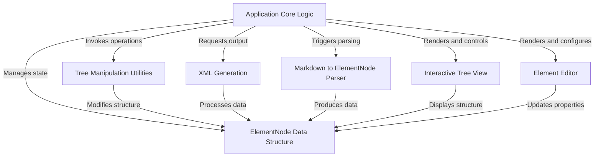
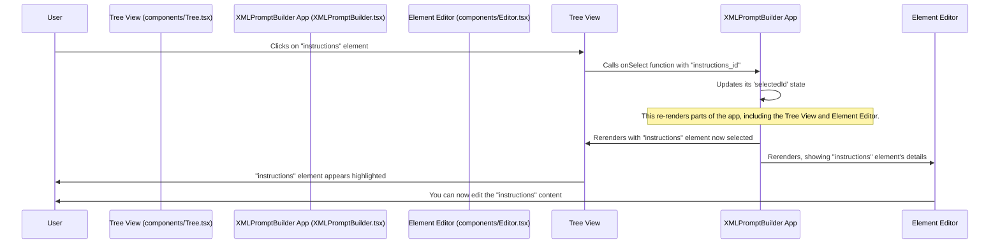
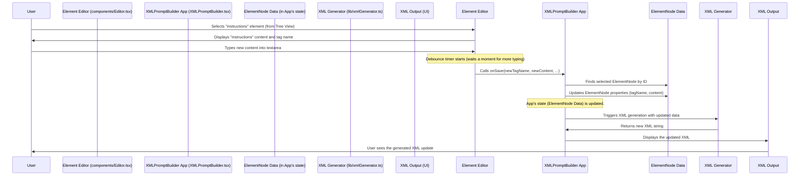
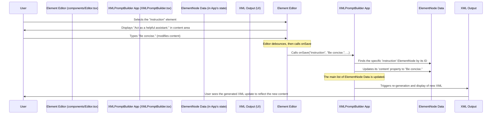
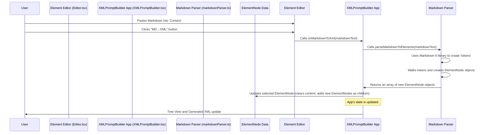
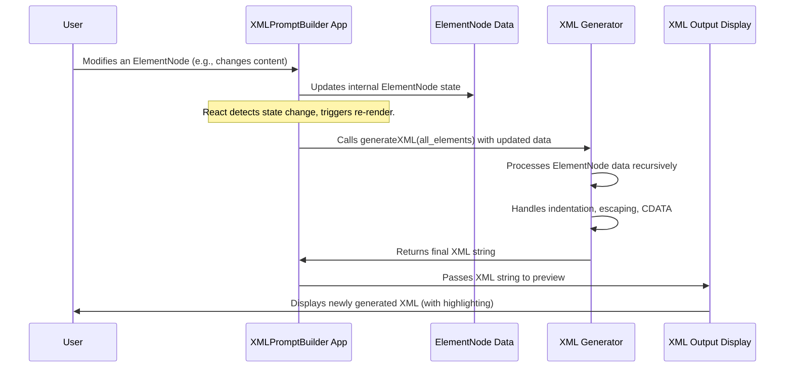
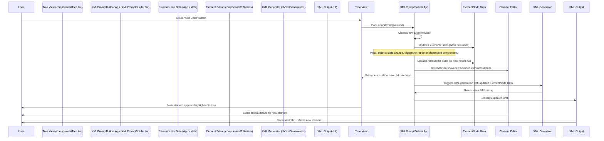

# Tutorial: XMLPromptBuilder

This project, **XMLPromptBuilder**, provides a user-friendly interface for building complex XML prompts. It allows users to create and manage *hierarchical structures* of XML elements using an interactive tree view and a detailed editor. You can *easily convert Markdown* content into structured elements and *generate the final XML output* for your AI prompts.


## Visual Overview



## Chapters

1. [Interactive Tree View
](01_interactive_tree_view_.md)
2. [Element Editor
](02_element_editor_.md)
3. [ElementNode Data Structure
](03_elementnode_data_structure_.md)
4. [Markdown to ElementNode Parser
](04_markdown_to_elementnode_parser_.md)
5. [XML Generation
](05_xml_generation_.md)
6. [Application Core Logic
](06_application_core_logic_.md)
7. [Tree Manipulation Utilities
](07_tree_manipulation_utilities_.md)

---

# Chapter 1: Interactive Tree View

Imagine you're building a complex recipe for an AI assistant. This recipe isn't just a simple text paragraph; it needs different sections like "Ingredients", "Instructions", "Tips", and maybe even "Sub-steps" within "Instructions". How do you keep all these parts organized, see their hierarchy, and easily move them around or add new ones? This is exactly what the **Interactive Tree View** helps you do in `XMLPromptBuilder`!

The Interactive Tree View is like a super-friendly "file explorer" for your AI prompt's structure. Instead of files and folders, it shows you all the pieces (which we call "elements" or "nodes") that make up your prompt. It's a visual way to understand and control the overall organization of your prompt.

## What is a "Tree View"?

Think of a family tree, or how folders are organized on your computer. You have a main folder, and inside it, there might be other folders or files. Those inner folders can also contain more items, and so on. This is a "tree" structure!

In `XMLPromptBuilder`, each part of your AI prompt, like an `<instructions>` section or an `<example>` block, is represented as a node in this tree. The Tree View shows you:

*   **Hierarchy**: Which elements are "parents" and which are "children." For example, an `<instructions>` element might have multiple `<step>` children.
*   **Order**: The sequence of elements at the same level.
*   **Collapsibility**: You can "fold" or "unfold" branches to hide or show child elements, just like collapsing a folder in a file explorer. This helps you focus on specific parts of your prompt.

## Your First Use Case: Structuring an AI Prompt

Let's say you want to build a prompt with a main `<prompt>` tag that contains a `<role>`, a `<context>`, and `<instructions>`. The Interactive Tree View is where you'll begin constructing this.

Here's how you'd interact with it:

1.  **See the structure**: When you open `XMLPromptBuilder`, you'll immediately see the tree on the left side.
2.  **Add a new main section**: You'll click a button to add a new top-level element, perhaps a `<prompt>` tag.
3.  **Add sub-sections**: Then, you'll click action buttons next to your `<prompt>` element to add children like `<role>`, `<context>`, and `<instructions>`.
4.  **Reorder**: If you decide `<context>` should come before `<role>`, you'd use the "move up" or "move down" buttons next to these elements.

This visual and interactive approach makes building and rearranging complex prompt structures incredibly easy.

## How to Interact with the Tree View

The Tree View provides several ways to manipulate your prompt's structure directly:

*   **Selecting Elements**: Click on any element (like `<instructions>`) in the tree. This highlights it and loads its details into the [Element Editor](02_element_editor_.md) on the right, where you can modify its tag name and content.
*   **Expanding/Collapsing**: If an element has children, you'll see a small arrow (▶ or ▼) next to it. Clicking this arrow will expand the branch to show its children or collapse it to hide them.
*   **Adding Children**: Next to each element, there's a "plus" button (<PlusCircle> icon). Clicking it adds a new child element directly under that selected parent. You can also add a new root-level element using a button at the top of the Tree View.
*   **Deleting Elements**: The "trash can" button (<Trash2> icon) lets you remove an element and all its children from the prompt structure.
*   **Moving Elements**: "Up" and "down" arrow buttons (<ArrowUp>, <ArrowDown> icons) allow you to change the order of an element relative to its siblings (elements at the same level).

## Under the Hood: How the Tree View Works

Let's see a simplified look at what happens when you interact with the Tree View.

### The Flow of Interaction: Selecting an Element

When you click on an element in the Tree View, a series of steps occur to update the application:



### The Code Behind the Tree

The core logic for the Interactive Tree View is managed by two main components: `Tree` and `TreeNode`. You can find them in `src/components/Tree.tsx`.

The `XMLPromptBuilder` component (the main application) is responsible for holding the overall list of elements and the currently selected element's ID. It then passes these down to the `Tree` component.

Here’s a simplified look at how `XMLPromptBuilder` uses the `Tree` component:

```typescript
// src/XMLPromptBuilder.tsx (simplified)
import React, { useState } from 'react';
import Tree from './components/Tree'; // Import the Tree component
import type { ElementNode } from './lib/types'; // We'll learn about ElementNode soon!

function AppInner() {
  const [elements, setElements] = useState<ElementNode[]>([]); // The main prompt structure
  const [selectedId, setSelectedId] = useState<string | null>(null); // Which element is currently selected

  // Functions to handle user actions, passed to the Tree component
  const handleSelect = (id: string) => setSelectedId(id);
  const handleAddChild = (parentId: string | null) => { /* ... add logic ... */ };
  const handleDelete = (id: string) => { /* ... delete logic ... */ };
  // ... other handlers like onToggleCollapse, onMoveUp, onMoveDown ...

  return (
    <main className="grid lg:grid-cols-3 gap-4">
      <aside className="col-span-1">
        {/* The Tree component is rendered here */}
        <Tree
          elements={elements}        // The full list of elements
          selectedId={selectedId}    // The ID of the currently selected element
          onSelect={handleSelect}    // Function to call when an element is clicked
          onAddChild={handleAddChild} // Function to call when "add child" is clicked
          onDelete={handleDelete}    // Function to call when "delete" is clicked
          // ... other action handlers ...
        />
      </aside>
      {/* ... other parts of the UI like the Editor ... */}
    </main>
  );
}
```
The `Tree` component receives the entire `elements` array (which represents the top-level items in your prompt structure) and various functions as "props" (properties). These functions are callbacks that `Tree` will use to tell the main application when a user has performed an action.

Inside `src/components/Tree.tsx`, the `Tree` component then renders individual `TreeNode` components for each top-level element. Each `TreeNode` recursively renders its own children, creating the nested structure.

```typescript
// src/components/Tree.tsx (simplified)
// ... imports ...
export default function Tree({ elements, selectedId, onSelect, onAddChild, onDelete, onToggleCollapse, onMoveUp, onMoveDown, className = '' }: Props) {
  // ... (Header with 'Add root' button) ...

  return (
    <ul className="space-y-1" role="tree" aria-label="Structure tree">
      {elements.map(el => (
        <TreeNode
          key={el.id}
          node={el}           // The current element to render
          depth={0}           // Its nesting level (0 for top-level)
          selectedId={selectedId}
          onSelect={onSelect} // Passed down to the TreeNode
          onAddChild={onAddChild}
          onDelete={onDelete}
          onToggleCollapse={onToggleCollapse}
          onMoveUp={onMoveUp}
          onMoveDown={onMoveDown}
        />
      ))}
    </ul>
  );
}
```

The `TreeNode` component is where the magic of interaction happens. It renders a single element and its action buttons. It also handles the logic for expanding/collapsing and recursively rendering its own child `TreeNode`s.

```typescript
// src/components/Tree.tsx (simplified TreeNode component)
// ... imports ...

function TreeNode({ node, depth, selectedId, onSelect, onAddChild, onDelete, onToggleCollapse, onMoveUp, onMoveDown }: /* ... props ... */) {
  const isSelected = selectedId === node.id;
  const collapsed = !!node.collapsed; // Check if the node is marked as collapsed

  const handleSelect = (e: React.MouseEvent) => {
    e.stopPropagation(); // Stop event from bubbling up
    onSelect(node.id);   // Call the onSelect function passed from above
  };

  const handleToggle = (e: React.MouseEvent) => {
    e.stopPropagation();
    onToggleCollapse(node.id); // Call the onToggleCollapse function
  };

  return (
    <li role="none">
      <div
        role="treeitem"
        className={`node ${isSelected ? 'selected' : ''}`} // Apply 'selected' class if this is the chosen node
        onClick={handleSelect} // Handle clicks to select this node
        tabIndex={0}
      >
        {/* Expand/collapse icon */}
        <div onClick={handleToggle} className="node-action-btn">
          {node.children && node.children.length > 0 ? (
            collapsed ? <ChevronRight size={16} /> : <ChevronDown size={16} />
          ) : (
            <div style={{ width: 16, height: 16 }} /> // Spacer if no children
          )}
        </div>

        {/* Node's label (tag name and content snippet) */}
        <div className="flex-1 min-w-0"><NodeLabel node={node} /></div>

        {/* Action buttons */}
        <div className="flex items-center gap-1">
          <button title="Add child" onClick={(e) => { e.stopPropagation(); onAddChild(node.id); }} /* ... */ > <PlusCircle size={14} /> </button>
          <button title="Delete" onClick={(e) => { e.stopPropagation(); onDelete(node.id); }} /* ... */ > <Trash2 size={14} /> </button>
          {/* ... other action buttons like move up/down ... */}
        </div>
      </div>

      {/* Render children recursively if not collapsed */}
      {!collapsed && node.children && node.children.length > 0 ? (
        <ul role="group" className="mt-1">
          {node.children.map(child => (
            <TreeNode
              key={child.id}
              node={child}
              depth={depth + 1} // Increase depth for children
              selectedId={selectedId}
              onSelect={onSelect}
              onAddChild={onAddChild}
              onDelete={onDelete}
              onToggleCollapse={onToggleCollapse}
              onMoveUp={onMoveUp}
              onMoveDown={onMoveDown}
            />
          ))}
        </ul>
      ) : null}
    </li>
  );
}
```
This code shows how user clicks trigger the `onSelect` or `onAddChild` functions. These functions then update the main `elements` state in `XMLPromptBuilder.tsx`. When the `elements` state changes, React efficiently re-renders only the necessary parts of the UI, including the `Tree` view, reflecting your changes immediately.

The `NodeLabel` component, used within `TreeNode`, is a small helper that displays the element's tag name and a brief snippet of its content, making it easier to identify elements at a glance.

```typescript
// src/components/Tree.tsx (NodeLabel component)
function NodeLabel({ node }: { node: ElementNode }) {
  const contentSnippet = (node.content || '').replace(/\n+/g, ' ').trim();
  const displaySnippet = contentSnippet.length > 60 ? contentSnippet.slice(0, 60) + '…' : contentSnippet;

  return (
    <div className="flex items-center gap-2 truncate">
      {/* Icon for code block or regular text */}
      {node.codeBlock ? <Code size={14} /> : <FileText size={14} />}
      <div className="flex flex-col min-w-0">
        <div className="text-sm font-medium truncate">
          <span className="tag-badge">{node.tagName || 'unnamed'}</span>
        </div>
        {displaySnippet ? <div className="text-xs text-slate-400 truncate">{displaySnippet}</div> : null}
      </div>
    </div>
  );
}
```
This component helps you quickly see what each element represents without needing to select it and view its full content in the editor.

## Conclusion

The Interactive Tree View is your primary interface for building and organizing the structure of your AI prompts. It provides a clear visual representation of your prompt's hierarchy and offers direct, intuitive controls to manipulate it. By understanding how to select, expand, collapse, add, delete, and move elements, you can efficiently construct even the most complex prompt structures.

In the next chapter, we'll dive into the [Element Editor](02_element_editor_.md), which is the companion panel to the Tree View. While the Tree View helps you manage the *structure*, the Element Editor will allow you to modify the *details* of each individual element.

---

# Chapter 2: Element Editor

In [Chapter 1: Interactive Tree View](01_interactive_tree_view_.md), you learned how to build and organize the overall structure of your AI prompt. You can add new elements, arrange them, and see their hierarchy. But what happens when you want to actually *fill in* the details of those elements? What if you want to write the specific instructions for an AI, or paste a code snippet, or change an element's name from `new_tag` to something more meaningful like `role`?

This is where the **Element Editor** comes into play!

Imagine the [Interactive Tree View](01_interactive_tree_view_.md) as your blueprint for a house, showing all the rooms and how they connect. The Element Editor is like walking into a specific room (an element) and deciding its paint color (tag name), what furniture goes inside (content), and if it has special features like a fireplace (code block setting). It's your control panel for customizing each individual piece of your AI prompt.

## What is the Element Editor?

The Element Editor is the dedicated panel on the right side of `XMLPromptBuilder`. When you click on an element in the [Interactive Tree View](01_interactive_tree_view_.md), the Element Editor instantly loads and displays all the specific details for *that selected element*. You can then change these details directly.

Here’s a quick overview of what you can control:

*   **Tag Name**: This is the name of your XML element, like `<instructions>` or `<example>`.
*   **Content**: This is the actual text, code, or data that will go inside your XML element.
*   **Code Block**: A special checkbox to tell the system that the content is a piece of code. This is important for AI models, as code often needs to be treated differently than regular text.
*   **Code Language**: If you mark an element as a code block, you can also specify the programming language (e.g., `python`, `javascript`).
*   **Force CDATA**: A more advanced XML feature. Sometimes, your content might contain characters that XML usually treats as special (like `<` or `>`). Forcing CDATA ensures these are treated as plain text, preventing XML errors.

## Your First Use Case: Customizing an AI Instruction

Let's put the Element Editor to work. Imagine you've created a new element called `<instructions>` in the [Interactive Tree View](01_interactive_tree_view_.md), and now you need to give the AI specific directions. You also want to include a Python code example.

Here's how you'd use the Element Editor:

1.  **Select the Element**: In the [Interactive Tree View](01_interactive_tree_view_.md) (on the left), click on your `<instructions>` element.
2.  **Edit the Tag Name**: The "Tag Name" field in the Editor will show `instructions`. You can change it if you made a mistake (e.g., to `prompt_instructions`).
3.  **Add Content**: In the large "Content" text area, type or paste the instructions for your AI:
    ```
    Please act as a data analyst. Your task is to extract
    the average sales for each product from the provided data.
    ```
4.  **Add a Code Example**: Now, let's say you added another child element under `instructions` in the Tree View and named it `code_example`. Select `code_example` in the Tree View.
5.  **Paste Code**: In the "Content" area for `code_example`, paste your Python code:
    ```python
    import pandas as pd
    
    data = {'product': ['A', 'B', 'A', 'C'], 'sales': [100, 150, 120, 200]}
    df = pd.DataFrame(data)
    
    avg_sales = df.groupby('product')['sales'].mean()
    print(avg_sales)
    ```
6.  **Mark as Code Block**: Check the "Code Block" checkbox.
7.  **Select Language**: Choose `python` from the dropdown list that appears.

That's it! Your changes are saved automatically, and you'll see the generated XML update immediately to reflect these new details.

## How to Interact with the Element Editor

The Editor component presents a straightforward form for modifying the properties of the selected element:

*   **Tag Name Input**: A small text field for the element's name.
*   **Content Text Area**: A larger area where you type the main text or code for the element.
*   **Code Block Checkbox**: Toggles whether the element's content should be treated as a code block.
*   **Language Dropdown**: Appears only if "Code Block" is checked, allowing you to pick a programming language.
*   **Force CDATA Checkbox**: For special XML handling.

Most of your changes (typing in content, changing tag names, checking boxes) are automatically saved after a short delay, so you don't have to constantly click a "Save" button. There is an explicit "Save" button available if you want to force a save immediately.

You'll also see some action buttons:

*   **Add Child**: A quick way to add a new child element to the currently selected element. (Similar to the plus button in the Tree View).
*   **Auto Child**: If your content has a list (like "1. item one", "2. item two"), this button can automatically turn each list item into its own child element.
*   **MD→XML**: This is a powerful feature we'll explore in [Chapter 4: Markdown to ElementNode Parser](04_markdown_to_elementnode_parser_.md). It takes Markdown text from the content area and converts it into a structure of child elements.

## Under the Hood: How the Element Editor Works

The Element Editor is a "smart form" that listens for changes you make and communicates them back to the main application.

### The Flow of Interaction: Editing an Element

Let's trace what happens when you modify an element's content:



### The Code Behind the Editor

The core logic for the Element Editor lives in `src/components/Editor.tsx` and interacts closely with `src/XMLPromptBuilder.tsx`.

1.  **`XMLPromptBuilder` passes data to `Editor`**:
    The main `XMLPromptBuilder` component is responsible for knowing which element is currently selected. It finds the full `ElementNode` data for this selected element and passes it as a `prop` (property) to the `Editor` component. It also passes a function called `saveSelected` so the Editor can tell the main app when something has changed.

    ```typescript
    // src/XMLPromptBuilder.tsx (simplified)
    // ... imports ...
    import Editor from './components/Editor';

    function AppInner() {
      // ... state declarations ...
      const [selectedId, setSelectedId] = useState<string | null>(elements[0]?.id ?? null);
      // ... utility functions ...

      const selectedElement = findById(selectedId, elements); // Find the full object

      function saveSelected(tagName: string, content: string, codeBlock?: boolean, codeLanguage?: string | null, forceCDATA?: boolean) {
        if (!selectedId) { /* ... handle no selection ... */ return; }
        setElements(prev => { // Update the main list of elements
          const cloned = clone(prev);
          function update(list: ElementNode[]): boolean {
            for (const el of list) {
              if (el.id === selectedId) { // Find the correct element
                el.tagName = tagName.trim() || el.tagName;
                el.content = content;
                // ... update other properties ...
                return true;
              }
              if (el.children && update(el.children)) return true;
            }
            return false;
          }
          update(cloned); // Call helper to update the element in the tree
          return cloned;
        });
      }

      return (
        <main className="grid lg:grid-cols-3 gap-4">
          <aside className="col-span-1">{/* Tree View here */}</aside>
          <section className="col-span-2 space-y-4">
            <Editor
              selected={selectedElement} // The currently selected element's data
              onSave={saveSelected}     // Function to call when changes occur
              onAddChild={() => addElement(selectedId || null)}
              // ... other action handlers ...
            />
            {/* ... Generated XML output ... */}
          </section>
        </main>
      );
    }
    ```
    The `saveSelected` function is crucial. When called by the `Editor`, it searches through the entire `elements` tree (which represents all your prompt components) to find the element that matches `selectedId`. Once found, it updates its `tagName`, `content`, and other properties. Because `setElements` is called, React knows the main data has changed and will re-render parts of the application, including the XML output.

2.  **`Editor` manages its own state and calls `onSave`**:
    The `Editor` component has its own internal state variables (`tagName`, `content`, `codeChecked`, etc.) that hold the values currently displayed in its input fields.

    The first `useEffect` makes sure that whenever you click a *different* element in the [Interactive Tree View](01_interactive_tree_view_.md), the `Editor` component resets its input fields to show the details of the *newly selected* element.

    The second `useEffect` is where the "auto-save" magic happens. It watches for any changes to the `tagName`, `content`, `codeChecked`, `selectedLang`, or `forceCDATA` state variables. When a change occurs, it sets a short timer (450 milliseconds). If no further changes happen during that time, it calls the `onSave` function (which is `saveSelected` from `XMLPromptBuilder.tsx`) to update the main application state. If you type quickly, the timer is reset, preventing unnecessary saves until you pause.

## Conclusion

The Element Editor is your precision tool for refining each part of your AI prompt. While the [Interactive Tree View](01_interactive_tree_view_.md) gives you the big picture and structure, the Editor allows you to dive into the details: naming elements, filling them with content, and applying specific settings like marking them as code blocks. Together, these two components provide a complete and intuitive way to craft complex XML prompts.

In the next chapter, we'll peel back another layer and look at the actual data structure that holds all this information: the [ElementNode Data Structure](03_elementnode_data_structure_.md). This will give you a deeper understanding of how the application internally represents your prompt.

[Chapter 3: ElementNode Data Structure](03_elementnode_data_structure_.md)

---

# Chapter 3: ElementNode Data Structure

In [Chapter 1: Interactive Tree View](01_interactive_tree_view_.md), you learned how to visually arrange the sections of your AI prompt. Then, in [Chapter 2: Element Editor](02_element_editor_.md), you discovered how to fill in the details like tag names and content for each section. But how does `XMLPromptBuilder` actually *remember* all of this information internally? When you add a new element, or type some text, where does that data go before it becomes the final XML?

This is where the **ElementNode Data Structure** comes in!

Imagine `XMLPromptBuilder` is like a Lego set for your AI prompts. The [Interactive Tree View](01_interactive_tree_view_.md) shows you the overall shape of your Lego creation, and the [Element Editor](02_element_editor_.md) lets you pick colors and add details to individual Lego bricks. But each one of those Lego bricks, whether it's a simple 2x2 or a complex specialized piece, needs a way to be described. The `ElementNode` is exactly that description – it's the fundamental "blueprint" for each piece of your XML prompt.

## What is an `ElementNode`?

At its heart, an `ElementNode` is a special kind of "object" (a bundle of related information) that represents a single XML tag, like `<instruction>` or `<example>`. It's the application's internal "memory" for all the characteristics of that tag.

Think of it like a detailed card for each Lego brick you use:

*   **Its Name**: What kind of brick is it? (e.g., `instruction`, `example`).
*   **Its Text**: What's written on the brick? (e.g., "Follow these steps...").
*   **Its Special Features**: Does it have special properties? (e.g., is it a "code block"?).
*   **Its Connections**: Does it have other smaller bricks attached to it? (e.g., `step` bricks inside an `instruction` brick).

Each time you interact with the [Interactive Tree View](01_interactive_tree_view_.md) or the [Element Editor](02_element_editor_.md), you're actually creating or modifying these `ElementNode` objects behind the scenes.

## The Building Blocks of an `ElementNode`

An `ElementNode` holds several important pieces of information. Here's a breakdown of its key properties:

| Property Name | What it is | Example |
| :------------ | :--------- | :------ |
| `id`          | A unique identifier for this specific node. The app uses this to keep track of it, especially for selecting or moving it. | `abc123def` |
| `tagName`     | The name of the XML tag this node represents. | `"instruction"` (for `<instruction>`) |
| `content`     | The text or data that goes *inside* the XML tag. | `"Extract the key entities."` |
| `children`    | A list of other `ElementNode`s that are *nested* inside this one. This is how the tree structure is built! | `[childNode1, childNode2]` |
| `codeBlock`   | A `true`/`false` flag indicating if the `content` is a block of code. | `true` |
| `codeLanguage`| If `codeBlock` is true, this specifies the programming language (e.g., `"python"`). | `"javascript"` |
| `attributes`  | Any extra XML attributes for this tag (e.g., `type="system"`). Stored as a simple list of `key:value` pairs. | `{ "lang": "en" }` |
| `forceCDATA`  | A `true`/`false` flag to force the content to be wrapped in XML CDATA. (Advanced) | `true` |
| `collapsed`   | A `true`/`false` flag used by the [Interactive Tree View](01_interactive_tree_view_.md) to know if this node's children are hidden. | `false` |

The most important property for understanding the "tree" aspect is `children`. This property allows `ElementNode`s to contain other `ElementNode`s, creating the nested hierarchy that mirrors your XML structure.

## Building a Prompt with `ElementNode`s (The Use Case)

Let's see how a simple AI prompt structure would be represented using `ElementNode`s internally. Imagine you want to create the following XML prompt:

```xml
<prompt>
    <instruction>Act as a helpful assistant.</instruction>
    <example>
        <input>What is the capital of France?</input>
        <output>Paris</output>
    </example>
</prompt>
```

Here's how `XMLPromptBuilder` would store this internally using `ElementNode`s:

1.  **A `prompt` ElementNode**: This is the main "root" node.
    *   `tagName`: `"prompt"`
    *   `content`: `""` (no text directly inside `<prompt>`)
    *   `children`: This list would hold the `instruction` node and the `example` node.

2.  **An `instruction` ElementNode**: This is a child of `prompt`.
    *   `tagName`: `"instruction"`
    *   `content`: `"Act as a helpful assistant."`
    *   `children`: `[]` (no children inside `instruction`)

3.  **An `example` ElementNode**: This is also a child of `prompt`.
    *   `tagName`: `"example"`
    *   `content`: `""`
    *   `children`: This list would hold the `input` node and the `output` node.

4.  **An `input` ElementNode**: This is a child of `example`.
    *   `tagName`: `"input"`
    *   `content`: `"What is the capital of France?"`
    *   `children`: `[]`

5.  **An `output` ElementNode**: This is a child of `example`.
    *   `tagName`: `"output"`
    *   `content`: `"Paris"`
    *   `children`: `[]`

The app essentially maintains a large list (or tree) of these `ElementNode` objects in its memory. Each `id` helps it quickly find and update a specific node.

Here’s a simplified look at how this might appear in the application's internal data (imagine a list of these objects):

This array of `ElementNode` objects (where `children` can hold more `ElementNode`s) is the application's entire "knowledge" of your prompt's structure and content.

## Under the Hood: How the App Manages `ElementNode`s

When you click buttons or type text in `XMLPromptBuilder`, you're directly manipulating this hidden `ElementNode` data structure.

### The Flow of Interaction: Updating an ElementNode

Let's re-examine what happens when you edit the `content` of an `ElementNode` using the [Element Editor](02_element_editor_.md):



### The Code Behind the `ElementNode`

The definition of an `ElementNode` is found in `src/lib/types.ts`. This file acts like a dictionary, telling the entire application what an `ElementNode` looks like.

This `interface` (a blueprint for an object's shape) ensures that every `ElementNode` object throughout the application has these specific properties.

In `src/XMLPromptBuilder.tsx`, the main application component, a special React feature called "state" is used to hold the entire collection of `ElementNode`s. This state is often an array (`ElementNode[]`) representing the top-level elements, with each element potentially containing its own children lists.

Here's how the `XMLPromptBuilder` manages and updates these `ElementNode`s:

When `saveSelected` is called, it first makes a copy of the entire `elements` array (this is important in React to ensure updates are properly detected). Then, it searches through this copy, including looking inside children arrays, until it finds the `ElementNode` matching the `selectedId`. Once found, it directly updates the properties (`tagName`, `content`, `codeBlock`, etc.) of that `ElementNode` object. Finally, it tells React to use this newly updated `elements` array, which automatically causes the UI (like the generated XML output) to refresh with the latest changes.

## Conclusion

The `ElementNode` data structure is the hidden powerhouse of `XMLPromptBuilder`. It's the blueprint, the memory, and the core representation of your entire AI prompt. Every interaction you make in the [Interactive Tree View](01_interactive_tree_view_.md) or [Element Editor](02_element_editor_.md) directly manipulates these `ElementNode` objects. By understanding their properties and how they link together via the `children` array, you gain a deeper insight into how your complex XML prompts are built and managed internally by the application.

In the next chapter, we'll explore another powerful feature: the [Markdown to ElementNode Parser](04_markdown_to_elementnode_parser_.md). This tool takes plain Markdown text and automatically converts it into a structured set of `ElementNode`s, making it even easier to quickly build out your prompts!

[Chapter 4: Markdown to ElementNode Parser](04_markdown_to_elementnode_parser_.md)

---

# Chapter 4: Markdown to ElementNode Parser

In [Chapter 3: ElementNode Data Structure](03_elementnode_data_structure_.md), we explored how `XMLPromptBuilder` internally represents your prompt's structure and content using `ElementNode` objects. You learned that every heading, paragraph, and code block in your prompt is a carefully crafted `ElementNode` with properties like `tagName`, `content`, and `children`.

Now, imagine you have a lot of text, perhaps a detailed document or a long set of instructions, already written in Markdown. Manually creating an `ElementNode` for every heading, then another for each paragraph, and then carefully adding children for lists or code blocks in the [Interactive Tree View](01_interactive_tree_view_.md) and filling in content in the [Element Editor](02_element_editor_.md) would be incredibly time-consuming!

This is where the **Markdown to ElementNode Parser** comes to the rescue! It's like having a "universal translator" built into `XMLPromptBuilder` that understands Markdown syntax. Instead of manually building `ElementNode`s, you can simply paste your Markdown text, click a button, and the parser will automatically dissect your content (identifying headings, lists, code blocks, paragraphs, tables, etc.) and transform it into a structured array of `ElementNode`s. This makes converting naturally written text into your application's structured format much more intuitive and efficient.

## What is a Markdown to ElementNode Parser?

At its core, this parser takes a block of Markdown text (like the text you might write in a README file or a forum post) and converts it into the application's internal `ElementNode` format.

Think of it this way:

*   **Markdown**: This is a simple, easy-to-read, and easy-to-write plain text format that uses special characters to indicate structure (e.g., `#` for a heading, `-` for a list item, `` ` `` for code).
    ```markdown
    # My Recipe

    - Ingredient 1
    - Ingredient 2

    ```python
    print("Hello")
    ```
    ```
*   **ElementNode**: This is the structured JavaScript object representation that `XMLPromptBuilder` uses to manage your prompt, as we saw in [Chapter 3: ElementNode Data Structure](03_elementnode_data_structure_.md).

The Markdown to ElementNode Parser acts as the bridge between these two worlds. It reads the Markdown, understands its structure, and then generates the corresponding `ElementNode` objects.

## Your First Use Case: Converting a Markdown Recipe

Let's try a concrete example. Imagine you have a prompt for an AI that includes a recipe, and you've written it out in Markdown:

```markdown
# Simple Cake Recipe

This is a simple recipe to bake a cake.

## Ingredients
- 1 cup flour
- 1/2 cup sugar
- 2 eggs
- 1 tsp baking powder

## Instructions
1. Preheat oven to 350°F (175°C).
2. Mix dry ingredients.
3. Add wet ingredients.
4. Bake for 30 minutes.

### Tip
Don't open the oven frequently!

```javascript
// Example of a helper function for AI
function calculateBakeTime(temp, weight) {
  return temp * weight / 100;
}
```
```

Manually creating `ElementNode`s for `h1`, `p`, `h2`, `ul`, `li`, `ol`, `li`, `h3`, `pre`, `code` would be a lot of clicks and typing. With the parser, you can convert this whole block into a structured set of `ElementNode`s in one go.

## How to Use the Markdown Parser

The Markdown to ElementNode Parser is integrated into the [Element Editor](02_element_editor_.md).

Here's how you'd use it to convert our recipe example:

1.  **Select a Parent Element**: In the [Interactive Tree View](01_interactive_tree_view_.md) (on the left), click on an existing element where you want your Markdown content to be placed. For example, you might create a `<recipe>` element first and select it.
2.  **Paste Markdown**: In the [Element Editor](02_element_editor_.md) (on the right), paste your entire Markdown recipe into the "Content" text area of the selected `<recipe>` element.
3.  **Click the Magic Button**: Look for the `MD→XML` button in the actions section of the [Element Editor](02_element_editor_.md).
4.  **Observe the Transformation**:
    *   The `content` of your selected `<recipe>` element will likely be cleared (because its content is now expressed as children).
    *   You'll see a new set of `ElementNode`s appear as *children* of your `<recipe>` element in the [Interactive Tree View](01_interactive_tree_view_.md)!
        *   `<h1 tagName="h1">` (for "Simple Cake Recipe")
        *   `<p tagName="p">` (for "This is a simple recipe...")
        *   `<h2 tagName="h2">` (for "Ingredients")
        *   `<ul tagName="ul">` (which itself contains multiple `<li tagName="li">` children for each ingredient)
        *   ... and so on for all parts of your Markdown.

This immediately transforms your free-form Markdown into the precise, hierarchical `ElementNode` structure that `XMLPromptBuilder` uses.

Here's a simplified view of the `ElementNode`s that might be created:

```typescript
[
  {
    id: 'unique1',
    tagName: 'h1',
    content: 'Simple Cake Recipe',
    children: []
  },
  {
    id: 'unique2',
    tagName: 'p',
    content: 'This is a simple recipe to bake a cake.',
    children: []
  },
  {
    id: 'unique3',
    tagName: 'h2',
    content: 'Ingredients',
    children: []
  },
  {
    id: 'unique4',
    tagName: 'ul',
    content: '',
    children: [
      { id: 'unique5', tagName: 'li', content: '1 cup flour', children: [] },
      { id: 'unique6', tagName: 'li', content: '1/2 cup sugar', children: [] },
      // ... more ingredients ...
    ]
  },
  // ... similar nodes for Instructions, Tip, and the code block ...
  {
    id: 'unique_code',
    tagName: 'pre',
    content: '',
    children: [{
      id: 'unique_code_child',
      tagName: 'code',
      content: '// Example of a helper function for AI\nfunction calculateBakeTime(temp, weight) {\n  return temp * weight / 100;\n}',
      codeBlock: true,
      codeLanguage: 'javascript',
      children: []
    }]
  }
]
```

## Under the Hood: How the Markdown Parser Works

Let's peek behind the curtain to understand how this conversion happens.

### The Flow of Interaction: Markdown to ElementNode Conversion



### The Code Behind the Parser

The core logic for Markdown parsing lives in `src/lib/markdownParser.ts` and is triggered by the `XMLPromptBuilder` component.

1.  **Triggering the Parser in `XMLPromptBuilder.tsx`**:
    When you click the `MD→XML` button in the [Element Editor](02_element_editor_.md), it calls the `onMarkdownToXml` prop. This prop is linked to the `applyMarkdownToSelected` function in `src/XMLPromptBuilder.tsx`.

    This `applyMarkdownToSelected` function first calls `parseMarkdownToElements` (our actual parser). Then, it takes the resulting `parsedElements` and updates the selected `ElementNode` in the main `elements` state. It's smart enough to either replace the selected node's tag and content (if the Markdown starts with a heading, like `# My Title`), or simply add all the parsed elements as children if the Markdown is a general block of text or multiple elements.

2.  **The Parser Logic in `src/lib/markdownParser.ts`**:
    This file is where the heavy lifting happens. It uses a popular library called `markdown-it` to first convert the Markdown text into a series of "tokens" (small, identified pieces of the Markdown, like `heading_open`, `paragraph_open`, `text`, `list_item_open`, `code_block`). Then, it walks through these tokens and converts them into our `ElementNode` objects.

    The `parseMarkdownToElements` function is the entry point. It calls `md.parse()` to get the raw `tokens`. Then, `tokensToElements` iterates through these tokens. When it finds an "opening" token (like `heading_open`, `paragraph_open`, `fence`, `bullet_list_open`), it constructs a new `ElementNode` with the appropriate `tagName` and `content` (often extracted from an `inline` child token) and adds it to the `outputNodes` array. For complex structures like lists, it finds all nested items and adds them as children.

## Conclusion

The Markdown to ElementNode Parser is a powerful feature that vastly streamlines the process of inputting structured content into `XMLPromptBuilder`. By allowing you to write naturally in Markdown and then automatically converting that into a detailed hierarchy of `ElementNode`s, it saves time and reduces manual effort. It bridges the gap between human-readable text and the application's internal data model, making content creation intuitive and efficient.

In the next chapter, we'll see how all these `ElementNode`s, whether created manually or through the Markdown parser, are finally transformed into the complete XML string that you'll use for your AI prompts.

[Chapter 5: XML Generation](05_xml_generation_.md)

---

# Chapter 5: XML Generation

In [Chapter 3: ElementNode Data Structure](03_elementnode_data_structure_.md), we learned that `XMLPromptBuilder` stores all the details of your AI prompt—its structure, tag names, content, and special settings—as `ElementNode` objects. Then, in [Chapter 4: Markdown to ElementNode Parser](04_markdown_to_elementnode_parser_.md), we saw how you can even generate these `ElementNode`s automatically from Markdown text.

But here's a crucial question: AI models don't understand `ElementNode` objects or their internal JavaScript structure. They need a specific, perfectly formatted **XML string** to understand your prompt. How do we take all those carefully constructed `ElementNode` blueprints and turn them into the final, ready-to-use XML?

This is the job of **XML Generation**!

Imagine you're an architect, and the `ElementNode`s are your detailed blueprints for a building. XML Generation is like the master builder who takes those blueprints and meticulously constructs the actual physical building, ensuring every brick is in place, every window is correctly installed, and the entire structure is sound and ready for use. It transforms your internal data into the final, valid XML output.

## What is XML Generation?

XML Generation is the process of converting the internal `ElementNode` data structure (our "blueprints") into a complete, valid XML text string. This process handles all the nitty-gritty details to ensure the XML is correct and easily readable, both by the AI and by you.

It takes care of:

*   **Tag Names**: Turning `tagName: "instruction"` into `<instruction>`.
*   **Content**: Placing your text or code inside the tags.
*   **Hierarchy**: Ensuring child `ElementNode`s are nested correctly inside their parent's XML tags.
*   **Attributes**: Adding any `key="value"` pairs to tags, like `<role type="system">`.
*   **Indentation**: Adding spaces to make the XML easy to read with proper nesting.
*   **Escaping Special Characters**: Dealing with characters like `<` or `&` that have special meaning in XML so they don't break your prompt.
*   **CDATA Blocks**: Automatically wrapping code or complex text in `<![CDATA[...]]>` blocks to prevent XML errors.
*   **Syntax Highlighting (for the UI)**: Making the generated XML colorful and easy to scan in the application's preview.

## Your First Use Case: Seeing Your Prompt as XML

Let's revisit a simple prompt structure we looked at in [Chapter 3: ElementNode Data Structure](03_elementnode_data_structure_.md):

```xml
<prompt>
    <instruction>Act as a helpful assistant.</instruction>
    <example>
        <input>What is the capital of France?</input>
        <output>Paris</output>
    </example>
</prompt>
```

Internally, this is stored as a collection of `ElementNode` objects. The XML Generation module's job is to take those `ElementNode`s and produce the exact XML string you see above.

The best part? You don't have to do anything special to "generate" the XML! As you add elements in the [Interactive Tree View](01_interactive_tree_view_.md) or type content in the [Element Editor](02_element_editor_.md), the `XMLPromptBuilder` automatically calls the XML Generation process. You'll instantly see the updated XML in the "Generated XML" panel on the right side of the screen.

## How XML Generation Handles Details

Let's look at some specific examples of how the XML generator ensures your output is correct:

### 1. Indentation

Making XML readable is crucial. The generator automatically adds spaces (indentation) to show the nesting level:

*   **Input `ElementNode`s (simplified):**
    ```typescript
    const elements = [
      { tagName: 'prompt', content: '', children: [
        { tagName: 'instruction', content: 'Act as assistant.', children: [] }
      ]}
    ];
    ```
*   **Output XML:**
    ```xml
    <prompt>
      <instruction>Act as assistant.</instruction>
    </prompt>
    ```
    Notice the two spaces before `<instruction>`? That's automatic indentation.

### 2. Escaping Special Characters

XML has special characters like `<` (less than), `>` (greater than), `&` (ampersand), `"` (quote), and `'` (apostrophe). If your content contains these, they must be "escaped" (replaced with special codes) so XML parsers don't get confused.

*   **Input `ElementNode` (simplified):**
    ```typescript
    const el = {
      tagName: 'message',
      content: 'If x < 5 && y > 10, then it\'s true.',
      children: []
    };
    ```
*   **Output XML:**
    ```xml
    <message>If x &lt; 5 &amp;&amp; y &gt; 10, then it&apos;s true.</message>
    ```
    The `&lt;`, `&amp;`, and `&apos;` are the escaped versions of `<`, `&`, and `'`.

### 3. CDATA Blocks for Code or Raw Text

Sometimes, you have a lot of content with special characters, especially code. Escaping *every* character can make the XML very messy. For this, XML offers `<![CDATA[...]]>` blocks. Anything inside a CDATA block is treated as plain text, no escaping needed.

`XMLPromptBuilder` intelligently uses CDATA blocks in two scenarios:

*   **Automatic for Code Blocks**: If you mark an `ElementNode` as `codeBlock` in the [Element Editor](02_element_editor_.md), its content will automatically be wrapped in CDATA.
*   **Forced CDATA**: You can explicitly check "Force CDATA" in the [Element Editor](02_element_editor_.md) if your content has special XML-like syntax you want to preserve as-is.

*   **Input `ElementNode` (simplified):**
    ```typescript
    const codeEl = {
      tagName: 'code_snippet',
      content: 'function test() { console.log("Hello <world>"); if (x < 10) return; }',
      codeBlock: true, // This triggers CDATA
      children: []
    };
    ```
*   **Output XML:**
    ```xml
    <code_snippet>
      <![CDATA[function test() { console.log("Hello <world>"); if (x < 10) return; }]]>
    </code_snippet>
    ```
    Notice how the `<` and `>` inside the `function test()` are NOT escaped because they are within the CDATA block.

## Under the Hood: How XML is Generated

The XML generation process is constantly running in the background. Every time you make a change to an `ElementNode` (by editing its content, adding a child, moving it, etc.), the application quickly re-generates the entire XML output.

### The Flow of Interaction: Real-time XML Generation



### The Code Behind the Generator

The core logic for generating the XML string is found in `src/lib/xmlGenerator.ts`. It contains the main `generateXML` function and a helper for `highlightXML` for the UI.

1.  **The `generateXML` Function (`src/lib/xmlGenerator.ts`)**:
    This is the "master craftsman" function. It takes an array of `ElementNode`s (usually the top-level ones) and recursively processes them to build the complete XML string.

    This function is recursive, meaning it calls itself for each `ElementNode`'s children. It carefully checks whether to use a CDATA block or escape the content, and it adds the correct indentation (`pad`) based on the current nesting level.

2.  **The `highlightXML` Function (`src/lib/xmlGenerator.ts`)**:
    This function doesn't change the XML itself, but it adds special HTML tags (like `<span class="xml-tag">`) around different parts of the XML string. The browser then uses CSS (Cascading Style Sheets) to color these spans, making the XML preview easy to read.

    This function essentially "wraps" parts of the XML string with `<span>` tags that have specific CSS classes (e.g., `xml-tag`, `xml-attr-name`). Your browser then uses these classes to apply colors, like blue for tags and green for attributes, making the XML visually appealing in the UI.

### Integration in `XMLPromptBuilder.tsx`

The `XMLPromptBuilder.tsx` (the main application file) ties everything together. It watches for changes in the `elements` state (our `ElementNode` data). Whenever `elements` changes, it calls `generateXML` and then `highlightXML` to update the preview.

The `useMemo` hook is crucial for performance. It ensures that `generateXML` is only called when the `elements` data truly changes, preventing unnecessary work. The resulting `xml` string is then passed to `highlightXML` to prepare it for display in the browser. Finally, `dangerouslySetInnerHTML` is used to inject the HTML-formatted XML into the `<pre>` tag, making it visible and color-coded.

## Conclusion

XML Generation is the final, vital step in `XMLPromptBuilder`. It's the "master craftsman" that takes all your structured `ElementNode` data and transforms it into the complete, valid, and readable XML string that AI models need. By automatically handling indentation, escaping, CDATA blocks, and providing syntax highlighting, it ensures your prompts are both functional and easy to review. You don't interact with it directly; it works seamlessly in the background, providing real-time updates as you build your prompts.

With the ability to generate the final XML now understood, we've covered how the application takes your ideas from a visual structure all the way to a ready-to-use output. In the next chapter, we'll zoom out and look at the broader [Application Core Logic](06_application_core_logic_.md), seeing how all these pieces fit together to create a cohesive and powerful tool.

[Chapter 6: Application Core Logic](06_application_core_logic_.md)

---

# Chapter 6: Application Core Logic

In our journey so far, we've explored the individual components of `XMLPromptBuilder`: from the visual organization of the [Interactive Tree View](01_interactive_tree_view_.md) and the detail-editing power of the [Element Editor](02_element_editor_.md), to the fundamental [ElementNode Data Structure](03_elementnode_data_structure_.md), the magic of the [Markdown to ElementNode Parser](04_markdown_to_elementnode_parser_.md), and finally, how everything comes together in [XML Generation](05_xml_generation_.md). Each chapter focused on a specific "part" of the application.

But here's a big question: Who is the "boss" that makes sure all these parts talk to each other correctly? When you click "Add Child" in the [Interactive Tree View](01_interactive_tree_view_.md), how does the [Element Editor](02_element_editor_.md) know to show the new element, and how does the [XML Generation](05_xml_generation_.md) update? What about saving your work or switching themes?

This is where the **Application Core Logic** steps in!

Imagine `XMLPromptBuilder` as a busy orchestra. You've learned about the different instruments (Tree View, Editor, XML Generator) and how they make their own unique sounds. The Application Core Logic is like the **orchestra conductor**. It doesn't play an instrument itself, but it knows the entire score, tells each instrument when to play, how loud, and for how long, ensuring everyone stays in sync and creates beautiful music together. It's the "brain" that coordinates all actions, manages the main data, and handles global settings to ensure the entire application works as one cohesive unit.

## What is Application Core Logic?

The Application Core Logic is the central hub of `XMLPromptBuilder`. It's primarily responsible for:

1.  **Managing the Main Data:** It holds the master list of all your `ElementNode`s and knows which element is currently selected.
2.  **Orchestrating User Interactions:** When you perform an action (like adding, deleting, moving, or saving an element), the core logic processes that request and tells the relevant parts of the application to update.
3.  **Handling Global Concerns:** It manages things that affect the entire application, such as saving your work to your computer, loading previous work, switching between light and dark themes, or changing the language of the user interface.

It's the "glue" that connects all the individual features we've discussed so far.

## Your Central Use Case: A Cohesive Experience

You, as the user, interact with many parts of the application, but you expect it to behave as one seamless experience. The Application Core Logic is what makes this possible.

Let's trace a common interaction: **Adding a new element and seeing it everywhere.**

1.  You click the "Add Child" button next to an element in the [Interactive Tree View](01_interactive_tree_view_.md).
2.  The Core Logic gets this request. It creates a *new* `ElementNode` object.
3.  It adds this new `ElementNode` to its main list of elements (the `ElementNode` data structure).
4.  It then tells the [Interactive Tree View](01_interactive_tree_view_.md) to show the new element.
5.  It also updates the [Element Editor](02_element_editor_.md) to display the details of this new, selected element.
6.  Finally, it tells the [XML Generation](05_xml_generation_.md) module to re-generate the XML output, so you immediately see the new element in your final XML.

All these steps happen almost instantly, creating a smooth and responsive experience, thanks to the core logic coordinating everything.

## How to Interact with the Core Logic (Indirectly)

As a user, you don't directly "call" the core logic. Instead, you interact with the user interface components (like buttons in the [Interactive Tree View](01_interactive_tree_view_.md) or input fields in the [Element Editor](02_element_editor_.md)). These components then send messages to the core logic, which then decides what needs to happen next.

You're constantly interacting with it when you:

*   **Add, Delete, Move Elements**: The core logic updates the central list of `ElementNode`s.
*   **Edit Element Details**: The core logic updates the properties of the `selectedId` `ElementNode`.
*   **Load/Save Your Work**: The core logic reads from or writes to your browser's local storage.
*   **Switch Themes/Languages**: The core logic updates global settings that change the app's appearance.
*   **Use Templates or Clear All**: The core logic manipulates the entire structure of `ElementNode`s.

Essentially, every major action you take in the application goes through the Application Core Logic.

## Under the Hood: How the Core Logic Works

The heart of the `XMLPromptBuilder`'s core logic is primarily found in one file: `src/XMLPromptBuilder.tsx`. This file contains the main `AppInner` component, which acts as our "conductor."

### The Flow of Interaction: A Coordinated Update

Let's see how the "Add Child" example we discussed earlier flows through the system:



### The Code Behind the Core Logic

The `src/XMLPromptBuilder.tsx` file is where all the main application state and the functions that modify that state reside.

1.  **Central State Management**:
    The most crucial pieces are the `elements` and `selectedId` state variables, managed by React's `useState` hook. These hold the entire application's data.

    ```typescript
    // src/XMLPromptBuilder.tsx (simplified)
    import React, { useEffect, useMemo, useState, useCallback } from 'react';
    import type { ElementNode } from './lib/types';
    import { uid, clone } from './lib/utils';
    // ... other imports ...

    function AppInner() {
      // The main list of ALL ElementNodes in our prompt structure
      const [elements, setElements] = useState<ElementNode[]>(() => loadInitial());
      // The ID of the ElementNode currently selected in the Tree View
      const [selectedId, setSelectedId] = useState<string | null>(elements[0]?.id ?? null);
      // ... other state for toasts, validation, etc. ...

      // ... functions ...

    ```
    `usePersistentState` is a custom helper that wraps `useState` and `useEffect` to automatically save (when `state` changes) and load (on initial startup) data to your browser's local storage. This ensures your work is remembered even if you close and reopen the browser. The `useEffect` for `theme` similarly watches for changes and applies the correct `dark` class to the `<html>` element, visually switching the theme.

## Conclusion

The Application Core Logic, centered in `src/XMLPromptBuilder.tsx`, is the unseen but vital conductor of the `XMLPromptBuilder` orchestra. It manages the central `ElementNode` data, orchestrates all user interactions by updating this data, and handles global application concerns like persistence, themes, and language. By understanding that all roads lead to this central logic, you gain a complete picture of how all the individual parts of the application function together seamlessly to provide a powerful tool for building AI prompts.

In the next chapter, we'll dive a bit deeper into some of the helper functions used by the core logic to manipulate the `ElementNode` tree effectively: the [Tree Manipulation Utilities](07_tree_manipulation_utilities_.md).

[Chapter 7: Tree Manipulation Utilities](07_tree_manipulation_utilities_.md)

---

# Chapter 7: Tree Manipulation Utilities

In [Chapter 6: Application Core Logic](06_application_core_logic_.md), we saw how `XMLPromptBuilder` acts as the "orchestra conductor," managing the entire application's data and coordinating all interactions. You learned that when you click a button or type something, the core logic updates the central list of `ElementNode`s, which then causes other parts of the UI (like the [Interactive Tree View](01_interactive_tree_view_.md) and [XML Generation](05_xml_generation_.md)) to update.

But how exactly does the core logic change that list of `ElementNode`s, especially when they are deeply nested? It's easy to add something to a simple list, but what if you want to delete an element that has children, which itself is a child of another element, and so on? Or move an element up or down among its many siblings? Directly changing these complex nested structures can be tricky and error-prone.

This is where **Tree Manipulation Utilities** come into play!

Imagine your `ElementNode` tree is a complex, multi-branched LEGO structure. When you want to add a new brick, remove a whole section, or swap two bricks, you don't just blindly grab and pull. You need specialized "robot arms" (our utilities) that know exactly how to navigate the structure, make changes safely, and ensure the entire LEGO model remains stable and correct. These utilities are functions designed to perform these complex operations on your `ElementNode` tree, ensuring all changes are handled safely and correctly.

## What are Tree Manipulation Utilities?

The Tree Manipulation Utilities are a set of specialized helper functions that live in `XMLPromptBuilder`. Their sole purpose is to safely and correctly modify the hierarchical list of `ElementNode`s. They abstract away the complexity of "walking" through the tree (i.e., looking through all parent and child elements) to find the right spot to make a change.

Think of them as:

*   **`findById`**: A robot arm that can "scan" your entire LEGO structure and pinpoint a specific brick by its unique ID.
*   **`insertAsChild`**: An arm that knows how to securely attach a new brick as a child of another, even if that parent is deep inside the structure.
*   **`removeById`**: An arm that can carefully detach a specific brick (and all its attached smaller bricks) without damaging the rest of the model.
*   **`moveUpById` / `moveDownById`**: Arms that can gracefully swap the positions of two adjacent bricks at the same level.
*   **`clone`**: A magical machine that makes a perfect, independent copy of your entire LEGO structure before any changes are made (crucial for React's efficiency).

## Your Central Use Case: Managing the Tree in the UI

You use these utilities every time you interact with the [Interactive Tree View](01_interactive_tree_view_.md). Let's take a common interaction: **deleting an element.**

1.  In the [Interactive Tree View](01_interactive_tree_view_.md), you click the "trash can" icon next to an `<instruction>` element.
2.  The [Application Core Logic](06_application_core_logic_.md) receives this request.
3.  Instead of trying to manually figure out where that `<instruction>` element is in the nested `elements` array, the core logic calls the `removeById` utility, passing it the ID of the element to delete.
4.  The `removeById` utility then "walks" through the `elements` array, finds the element with that ID, carefully removes it (along with any of its children), and returns a **new, updated** list of elements.
5.  The core logic updates its state with this new list.
6.  React then efficiently re-renders the [Interactive Tree View](01_interactive_tree_view_.md) and the [XML Generation](05_xml_generation_.md) output to reflect the deletion.

This seamless process is entirely dependent on these "robot arm" utilities doing their job correctly and efficiently.

## Under the Hood: How Tree Utilities Work

Let's look at how the `XMLPromptBuilder` uses these utilities, focusing on the `src/lib/treeUtils.ts` file, where these specialized "robot arms" are defined.

### The Flow of Interaction: Deleting an Element

```mermaid
sequenceDiagram
    participant User
    participant Tree View (components/Tree.tsx)
    participant XMLPromptBuilder App (XMLPromptBuilder.tsx)
    participant Tree Utilities (lib/treeUtils.ts)
    participant ElementNode Data (App's state)

    User->>Tree View: Clicks "Delete" icon for an element
    Tree View->>XMLPromptBuilder App: Calls onDelete(elementId)
    XMLPromptBuilder App->>XMLPromptBuilder App: Calls requestDelete(elementId)
    XMLPromptBuilder App->>User: Displays confirmation modal
    User->>XMLPromptBuilder App: Clicks "Delete" in confirmation modal
    XMLPromptBuilder App->>XMLPromptBuilder App: Calls deleteElementConfirmed(elementId)
    XMLPromptBuilder App->>Tree Utilities: Calls removeById(currentElements, elementId)
    Tree Utilities->>Tree Utilities: Recursively searches and creates a new list without the element
    Tree Utilities->>XMLPromptBuilder App: Returns { removed: ElementNode, list: newElements }
    XMLPromptBuilder App->>ElementNode Data: Updates 'elements' state with newElements
    Note over XMLPromptBuilder App: React re-renders components dependent on 'elements'
    XMLPromptBuilder App->>User: Tree View updates; Element is gone
```

### The Code Behind the Utilities (`src/lib/treeUtils.ts`)

The `src/lib/treeUtils.ts` file contains the pure JavaScript functions that perform the tree manipulations. A key principle here (especially important for React applications) is **immutability**: these functions *never* directly change the original `elements` array. Instead, they create a brand new array with the changes applied. This is why the `clone` utility is so important.

1.  **`clone(list: ElementNode[])`**
    This utility (actually defined in `src/lib/utils.ts` but heavily used by `treeUtils`) creates a deep copy of your `ElementNode` array. "Deep copy" means it copies not just the top-level elements, but also all their children, grandchildren, and so on. This ensures that any modifications made by the `treeUtils` functions are on a fresh copy, leaving the original state untouched until `setElements` is called.

    This function uses a simple but effective trick (`JSON.parse(JSON.stringify(obj))`) to create a completely new copy of your data structure.

2.  **`findById(id: string | null, list: ElementNode[])`**
    This function helps the application find a specific `ElementNode` anywhere in the nested tree by its unique `id`.

    This function uses a technique called **recursion**. It checks the current list, and if it doesn't find the `id`, it calls itself (`findById`) on the `children` list of each element. This allows it to search through any level of nesting.

3.  **`removeById(list: ElementNode[], id: string)`**
    This function removes an `ElementNode` (and all its descendants) from the tree.

    Again, recursion is used. The `filter` method creates a new array without the matching element. For elements that are kept, their `children` list is also recursively processed to ensure any children of the removed element are handled, or children further down the tree are kept if their parent is kept.

4.  **`insertAsChild(list: ElementNode[], parentId: string | null, node: ElementNode)`**
    This function adds a new `ElementNode` as a child of a specified parent. If `parentId` is `null`, it adds the node as a new top-level element.

    This function first clones the list. If a `parentId` is provided, it recursively searches for that parent. Once found, it adds the `node` to the parent's `children` array. If no `parentId`, it simply adds the node to the top-level list.

5.  **`moveUpById(list: ElementNode[], id: string)` and `moveDownById(list: ElementNode[], id: string)`**
    These functions reorder an element among its siblings. `moveUpById` swaps an element with the one immediately before it, and `moveDownById` swaps it with the one immediately after.

    These functions also use recursion to find the correct `ElementNode`. Once found, they perform a simple swap with their adjacent sibling in the array, making sure they don't try to move an element if it's already at the top or bottom of its sibling group.

6.  **`clearAll(list: ElementNode[])`**
    This simple utility clears the entire tree, returning an empty array.

    ```typescript
    // src/lib/treeUtils.ts (simplified)
    export function clearAll(list: ElementNode[]): ElementNode[] {
      return []; // Just return an empty array!
    }
    ```

### Integration in `XMLPromptBuilder.tsx`

The [Application Core Logic](06_application_core_logic_.md) (`src/XMLPromptBuilder.tsx`) uses these utilities extensively. When an action occurs, it calls the appropriate `treeUtils` function and then updates its main `elements` state with the new list returned by the utility.

As you can see, the main application component doesn't need to know the complex details of how to find an element deep in a nested array or how to perform a swap. It just calls the appropriate `treeUtils` function, trusts it to return a correctly modified *new* array, and then updates its `elements` state with that new array. This makes the core logic much cleaner and easier to manage.

## Conclusion

The Tree Manipulation Utilities are the unsung heroes of `XMLPromptBuilder`'s interaction system. While you visually drag, click, and type, these specialized "robot arms" are diligently working behind the scenes. They provide robust, safe, and efficient ways for the [Application Core Logic](06_application_core_logic_.md) to modify the complex `ElementNode` data structure. By understanding how `findById`, `removeById`, `insertAsChild`, `moveUpById`, and `moveDownById` work, you now have a complete picture of how `XMLPromptBuilder` transforms your abstract ideas into a perfectly structured XML prompt.

---
